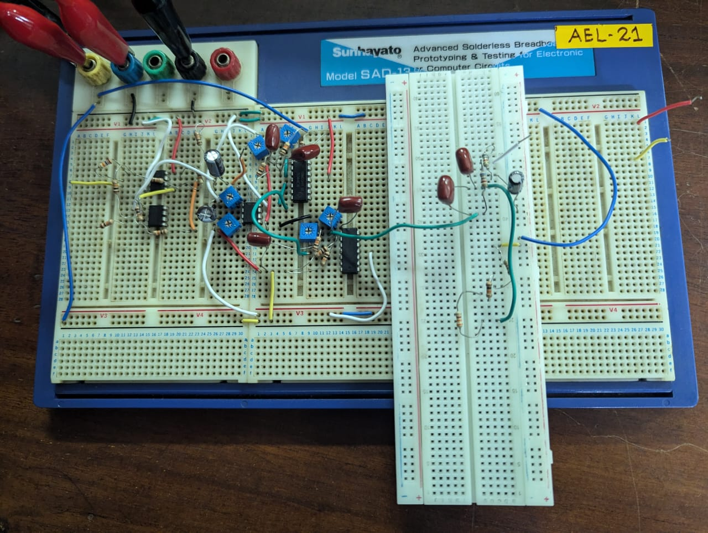
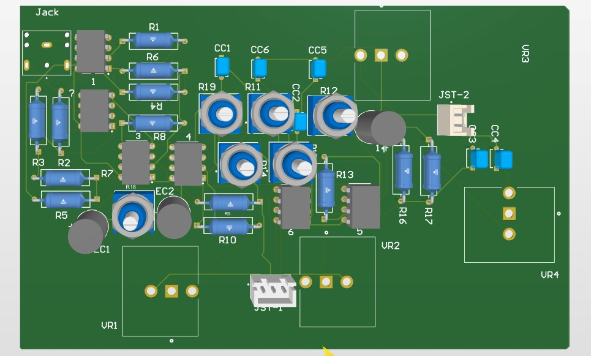
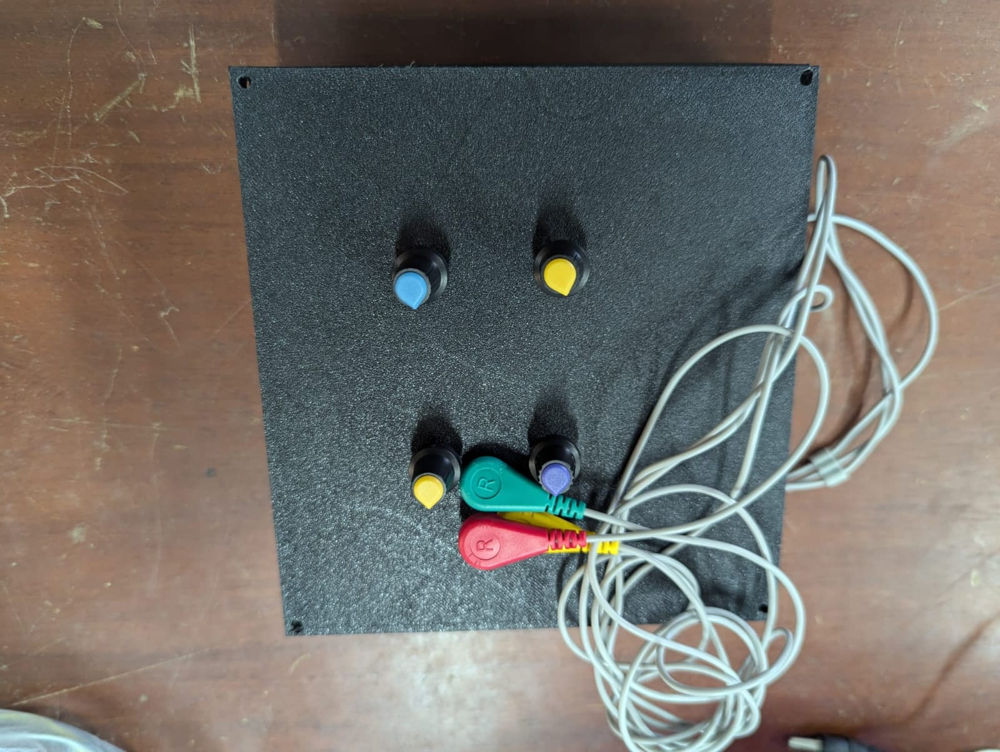
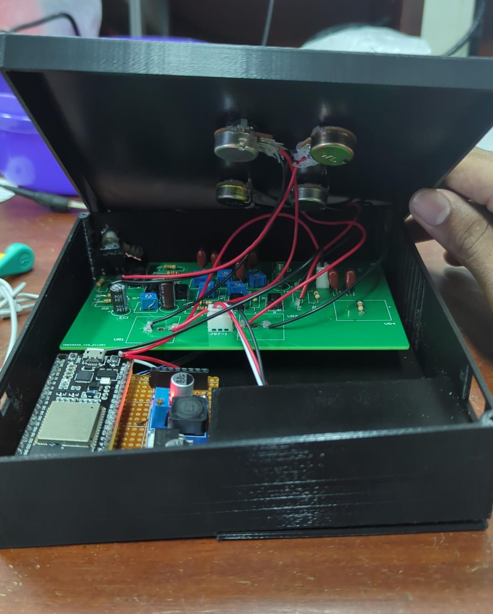

# 🦾 Muscle Cramp Detector - STEM Group  

## 📌 Overview  
Muscle cramps can be unpredictable and cause discomfort or pain, especially for athletes, workers, and patients with neuromuscular conditions.  
This project focuses on developing an **analog-based EMG filtering system** that captures and processes EMG signals using **hardware filters** and an **ESP32** to analyze muscle activity in **real-time**.  

The system **filters** and **transmits** the EMG signal to **ThingSpeak IoT Platform** for advanced **time-domain & frequency-domain analysis**. Since **ThingSpeak** has private channel restrictions, we also **built a custom website** for **real-time signal visualization**, making this a **mini web-based oscilloscope**.  

---

## 🛠️ Hardware & Components Used  

### **🔹 EMG Signal Acquisition**
- **Dry Electrodes** - Used to capture muscle signals non-invasively.  
- **Instrumentation Amplifier** - High CMRR, low-noise signal amplification.  

### **🔹 Analog Signal Processing**
- **4th-Order Low-Pass Filter** - Removes high-frequency noise.  
- **2nd-Order High-Pass Filter** - Eliminates DC offset and low-frequency artifacts.  
- **Notch Filter (50/60Hz)** - Suppresses power line interference.  
- **TL702 Op-Amp** - Selected for **high slew rate, high CMRR, and power rejection ratio**.  
- **Potentiometers** - Allow adjustable gain and cutoff frequency tuning.

### **🔹 IoT & Visualization**
- **ESP32** - Transmits processed signals to **ThingSpeak**.  
- **ThingSpeak IoT Platform** - Converts **time-domain** signals to **frequency-domain** for analysis.  
- **Custom Website** - Due to ThingSpeak's private channel restrictions, we designed a **web-based oscilloscope** to visualize both **time-domain & frequency-domain** EMG data.  

---

## 📊 Signal Processing Flow  
# 🔹 EMG Signal Processing Flow  

    [ EMG Dry Electrodes ]  
             ↓  
    [ Analog Filtering Circuit ]  
      (Low-Pass, High-Pass, Notch)  
             ↓  
    [ ESP32 Microcontroller ]  
      (Wi-Fi Transmission)  
             ↓  
    [ ThingSpeak IoT Platform ]  
      (FFT & Feature Extraction)  
             ↓  
    [ Custom Website ]  
      (Real-Time Signal Display)  
---

## 🎯 Features  
✅ **Real-time EMG signal acquisition**  
✅ **Analog-based filtering system** for clean signal extraction  
✅ **ThingSpeak IoT integration** for advanced signal processing  
✅ **Custom web-based oscilloscope** for visualization  
✅ **Adjustable filtering parameters** with potentiometers  
✅ **Potential for further feature extraction & classification**  

---

## 🖼️ Images & Demonstrations  

### **📌 1. Breadboard Implementation**
  

### **📌 2. Internal Circuit Structure**
  

### **📌 3. Final PCB Implementation**
  

### **📌 3. Final Product Implementation**
 
 

### **📌 4. ThingSpeak Data Uploading (Video)**
  

### **📌 5. Web-Based Oscilloscope Display**
  

---

## 👨‍💻 Contributors (STEM Group)  

---

## 🚀 Future Plans  
🔹 **Enhanced Signal Processing:** Implementing more **feature extraction techniques**.  
🔹 **Improved Web Interface:** Adding interactive visualization tools.   
 

---

